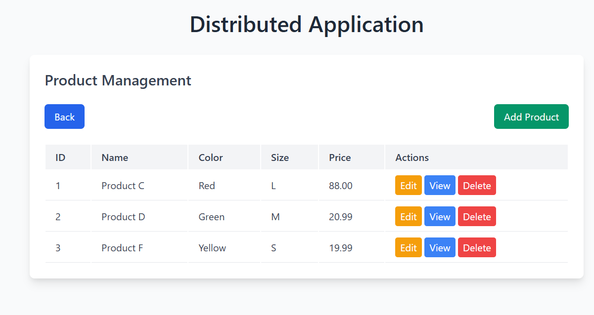
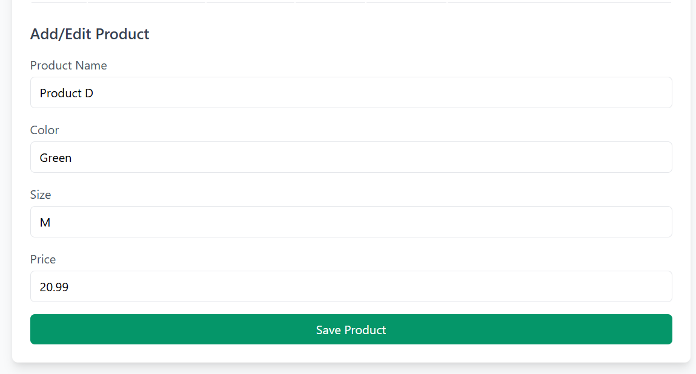
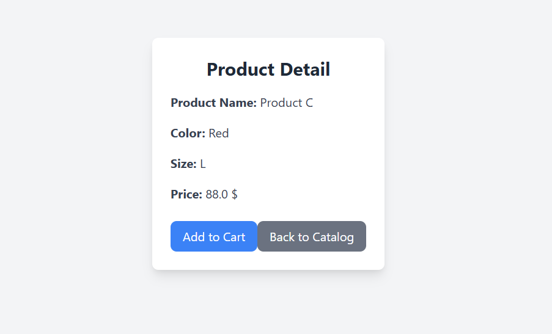
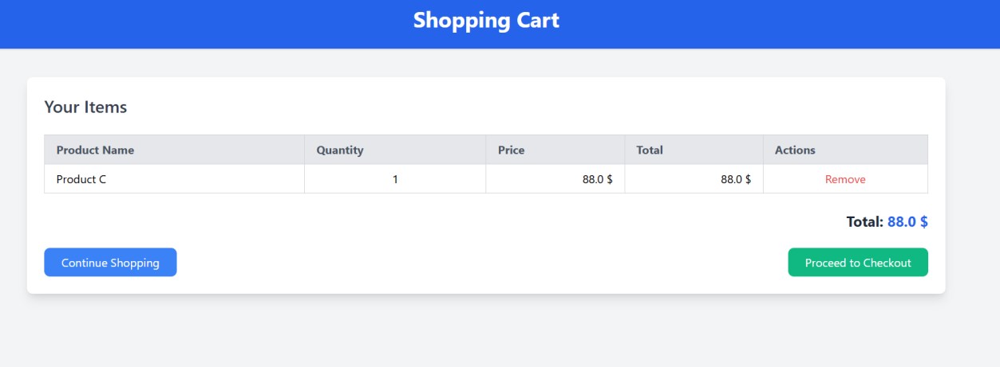
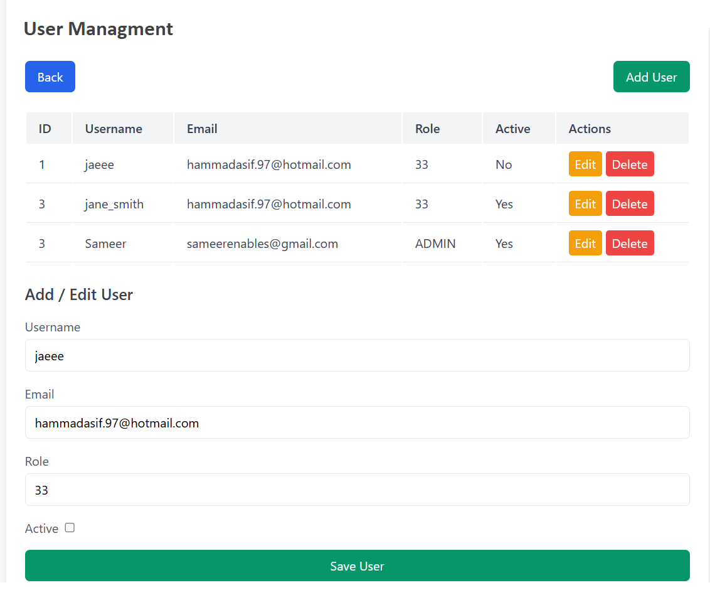

# 📦 Distributed Application — Spring Boot E-Commerce Platform

A server-rendered e-commerce application built with **Spring Boot 3.3.5 / Java 17** for the **Distributed Applications** course at **Hochschule Fulda**, demonstrating core distributed-systems and enterprise design patterns: layered architecture, the Facade and Adapter patterns, an internal SaaS-style API protected by API-key authentication, and real-time updates over WebSocket.

---

## 🖼️ Screenshots

**Product Management** — list, edit, delete


**Add / Edit Product**


**Product Detail**


**Shopping Cart**


**User Management**


---

## 🛠️ Tech Stack

| Layer | Tools |
|---|---|
| Backend | Java 17, Spring Boot 3.3.5, Spring MVC, Spring Data JPA |
| Views | Thymeleaf (server-rendered HTML) |
| Database | H2 in-memory database (JPA/Hibernate, `ddl-auto=update`) |
| Real-time | Spring WebSocket + STOMP over SockJS |
| Frontend (alt.) | Svelte + Vite scaffold (`my-svelte-frontend/`) for a SPA client of the same APIs |
| Build | Maven |
| Docs | Auto-generated JavaDocs (`/JavaDocs`) |

---

## 📁 Project Structure

```
├── src/main/java/com/example/Distributed/Application/
│   ├── Product/
│   │   ├── ProductController.java          # CRUD REST/MVC endpoints for products
│   │   ├── ProductDetailController.java    # Product detail page + reviews
│   │   ├── ProductDetailFacade.java        # Facade combining product + inventory + price
│   │   ├── ProductDetailDTO.java
│   │   ├── PriceCalculationService.java    # Rounding, currency conversion, vouchers
│   │   ├── Currency.java                   # EUR / USD enum
│   │   └── LoadProductDatabase.java
│   ├── Inventory/
│   │   ├── InventoryController.java        # Stock REST endpoints
│   │   └── InventoryService.java           # In-memory stock tracking
│   ├── AddToCart/
│   │   ├── ShoppingCartController.java
│   │   ├── ShoppingCartModel.java
│   │   └── ShoppingCartService.java
│   ├── Order/
│   │   ├── OrderController.java            # /checkout endpoint
│   │   ├── OrderFacade.java                # Facade: order + user lookup
│   │   ├── OrderAdapter.java               # Adapter: wraps facade + triggers email
│   │   ├── Order.java
│   │   └── EmailService.java               # Order confirmation (simulated)
│   ├── User/
│   │   ├── UserController.java             # Full CRUD REST API for users
│   │   ├── UserModel.java
│   │   └── UserService.java                # JSON-file backed persistence
│   ├── Review/
│   │   ├── ReviewController.java           # WebSocket @MessageMapping broadcast
│   │   ├── ReviewModel.java                # JPA entity
│   │   └── ReviewRepository.java
│   ├── Config/
│   │   ├── ApiKeyFilter.java               # X-API-KEY auth filter for /saas/** routes
│   │   ├── WebConfig.java
│   │   └── WebSocketConfig.java            # STOMP endpoint + message broker config
│   ├── Utils/JsonFileUtil.java
│   ├── SaaSCatalogController.java          # API-key-protected catalog endpoint
│   └── DistributedApplication.java         # Entry point
├── src/main/resources/
│   ├── templates/                          # catalog, cart, product, product-detail, user, order-success
│   └── application.properties
├── my-svelte-frontend/                     # Alternative Svelte + Vite SPA client
├── JavaDocs/                                # Generated API documentation
└── Screenshots/
```

---

## ✨ Features

- **Product catalog** — full CRUD (create, edit, delete, view) via `ProductController`
- **Inventory tracking** — per-product stock levels, sold-out detection
- **Shopping cart** — add/remove items, running total, checkout flow
- **Order checkout** — `/checkout` endpoint finalizes an order and triggers a confirmation email
- **User management** — full CRUD REST API, JSON-file backed persistence
- **Live product reviews** — submitted reviews are broadcast to all connected clients in real time over WebSocket (STOMP `/topic/reviews`), no page refresh needed
- **Currency conversion** — EUR ⇄ USD conversion service with configurable default currency
- **Voucher/discount calculation** — percentage-based price reduction, rounded to 2 decimals
- **Protected SaaS-style catalog API** — a separate `/saas/catalog` endpoint guarded by an `X-API-KEY` header filter, simulating a multi-tenant integration API distinct from the regular web-facing endpoints
- **Dual frontend options** — the primary UI is server-rendered Thymeleaf; a parallel Svelte + Vite SPA scaffold consumes the same REST endpoints

---

## 🏗️ Design Patterns Used

- **Facade** — `ProductDetailFacade` and `OrderFacade` hide the coordination between multiple services (product + inventory + pricing; order + user) behind a single simple call
- **Adapter** — `OrderAdapter` wraps `OrderFacade` and adds a cross-cutting side effect (sending the confirmation email) without changing the facade's interface
- **DTO** — `ProductDetailDTO` decouples the persistence model from what's rendered to the view
- **Filter chain** — `ApiKeyFilter` (a `GenericFilterBean`) enforces API-key authentication only on `/saas/**` routes, leaving the rest of the app open

---

## ▶️ Getting Started

```bash
git clone https://github.com/HammadAsif-997/Distributed-Application-Spring-Boot-Java.git
cd Distributed-Application-Spring-Boot-Java
./mvnw spring-boot:run
```

App runs at `http://localhost:8080`. H2 console available at `/h2-console` (JDBC URL `jdbc:h2:mem:testdb`, user `sa`).

**Optional Svelte frontend:**
```bash
cd my-svelte-frontend
npm install
npm run dev
```

---

## 👤 Author

**Hammad Asif**
- Matriculation Number: 1538490
- 📧 hmmd97@gmail.com
- 🔗 [LinkedIn](https://linkedin.com/in/hammad-asif-26466a91)
- 💻 [GitHub](https://github.com/HammadAsif-997)
